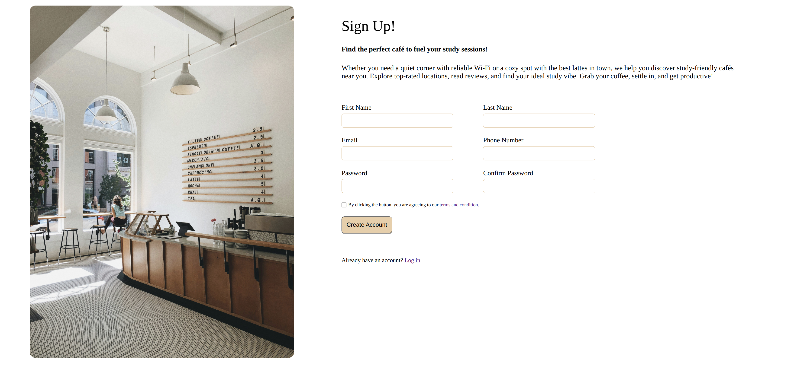

# Coffee Platform Sign-Up Form

An elegant and modern **sign-up form** designed for a coffee platform, built with **HTML & CSS (Flexbox)**. This form is structured to be easily integrated into a real website, providing users with a seamless registration experience.

## Try It Out
👉 [Live Demo](https://ismailcakmak.github.io/odin-projects/odin-sign-up-form/)

## Screen Shot


## Technologies Used
- **HTML5**
- **CSS3 (Flexbox)**

## How to Use
1. Clone the repository:
   ```sh
   git clone <repository-url>
   ```
2. Open `index.html` in your browser.
3. Customize or integrate the form into your project as needed.

## License
This project is open-source and free to use.

